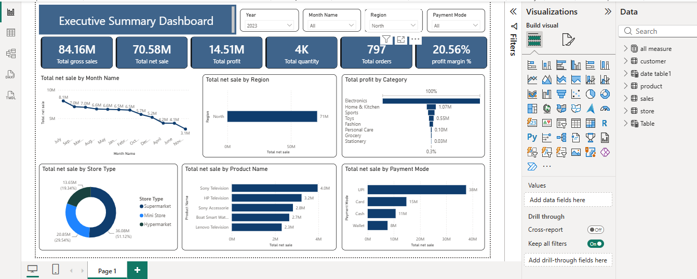

# 📊 Executive Summary & Sales Analytics Dashboard

An interactive, multi-dataset **Power BI** project analyzing sales performance, customer demographics, store operations, and product profitability across retail channels.

---

## 📌 Executive Summary

This repository integrates customer, store, product, and sales data into an interactive intelligence dashboard. Designed for data-driven business decisions, it tracks total revenue, customer acquisition trends, regional store metrics, and top-performing product categories.

---

## 🔑 Key Features & Insights

* **Executive Sales Tracking:** Visualizes total revenue, profit margins, order volumes, and key time-series trends.
* **Customer Demographics:** Segments purchasing behavior, lifetime value, and regional distributions.
* **Store Performance:** Evaluates individual store profitability, geographic reach, and channel efficiency.
* **Product Insights:** Highlights top-selling items, margin percentages, and product category breakdowns.

---

## 📊 Dashboard Preview



---

## 📁 Repository Structure

```text
├── README.md                           # Project documentation
├── Executive Summary Dashboard.pbix    # Power BI interactive report source file
├── Customers.xlsx                      # Customer profiles, demographics, and regional data
├── Products.xlsx                       # Product catalog, categories, and unit costs
├── Sales.xlsx                          # Order transactions, quantities, and dates
├── Stores.xlsx                         # Store locations, metadata, and operational details
└── Dashboard.png                       # Dashboard preview image for README display